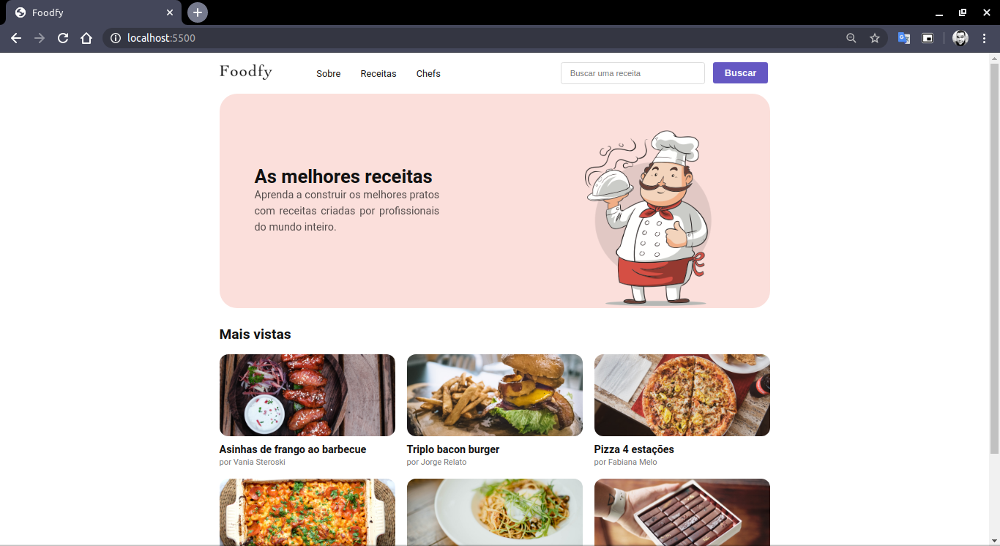
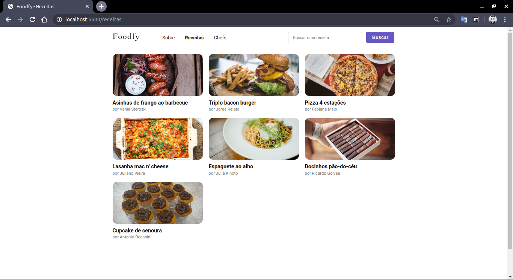
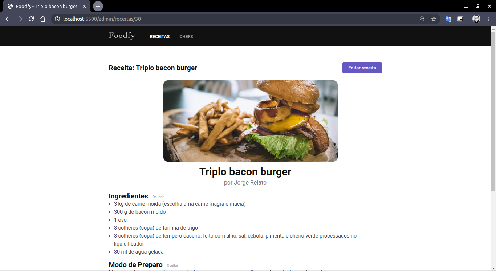
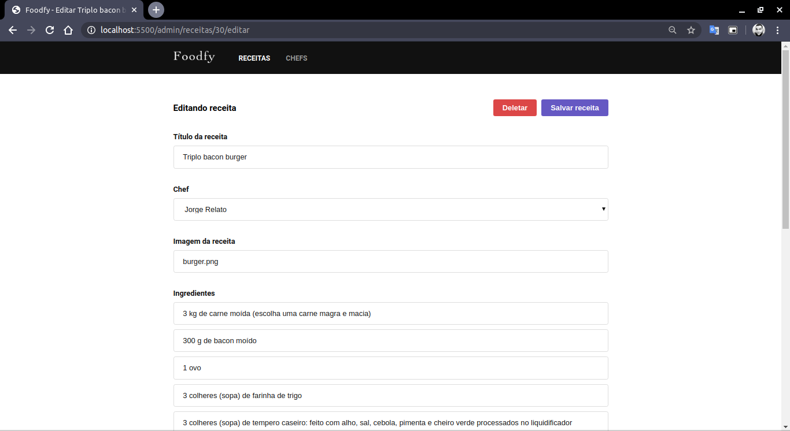
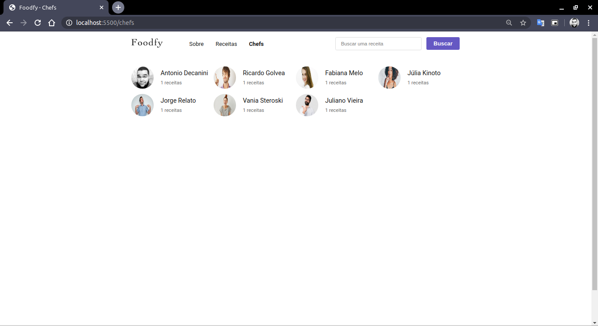

# 🍔 FoodFy

<p align="center">
  <a href="https://github.com/antoniodecanini">
    
  </a>

  
</p>

This site, was raised to studding fullstack web development, this idea was withdrawn of a Rocketseat Bootcamp, and I implemented this. This brought me many challenges, since I used technologies that I
didn't know.

<p align="center">
  

  

  

  

  

  
</p>

---

## 🚀 Getting Started

### Prerequisites
- To execute this project, you need to have installed:
  - node.js
  - postgreSQL (installed & configured)

### Step 1 - 👯 Clone this repo to your local machine and install dependencies
```
$ git clone https://github.com/antoniodecanini/FoodFy.git

$ cd FoodFy

$ npm install
```

### Step 2 - ⚙️ Make the settings
- In `src/config/db.js`, you will find the DB config
  - Fill all fields with your configuration.

### Step 3 - 🖥 Climb server
```
$ npm start
```

### Step 4 - ⬆️ Open site
- Open your browser, then:
  - Acces `http://localhost:5500`

---

## 📋 Features

### Build with
- Core
  - [node.js](https://nodejs.org/en/) - a JavaScript runtime built on Chrome's V8 JavaScript engine.

- Framework web
  - [express](http://expressjs.com/) - Fast, unopinionated, minimalist web framework for Node.js

- Template engine
  - [nunjucks](https://mozilla.github.io/nunjucks/) - Powerful language with block inheritance, autoescaping, macros, asynchronous control, and more.

- Database
  - [postgreSQL](https://www.postgresql.org/) - is a powerful, open source object-relational database system with over 30 years of active development that has earned it a strong reputation for reliability, feature robustness, and performance.

- Extras
  - [method-override](https://www.npmjs.com/package/method-override) - Lets you use HTTP verbs such as PUT or DELETE in places where the client doesn't support it.

  - [pg](https://www.npmjs.com/package/pg) - Non-blocking PostgreSQL client for Node.js. Pure JavaScript and optional native libpq bindings.

---

## 📝 License


This project is licensed under the MIT License - see the [LICENSE](LICENSE) file for details.

---

Made with ❤️ Enjoy it!
